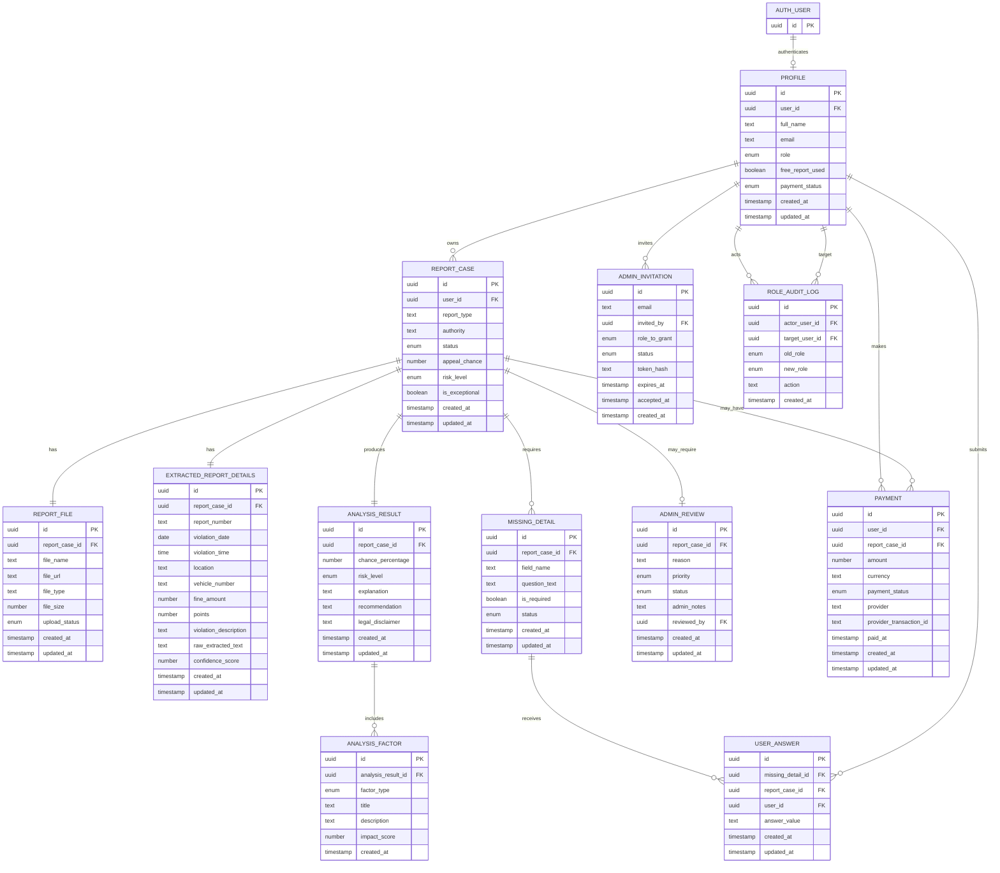

# TicketGuard - Backend Data Design for Module 8

## 1. Purpose

This document defines the future backend data model for TicketGuard before creating the Supabase tables.

TicketGuard is currently a frontend-only Hebrew RTL React app that lets users upload traffic, parking, or municipal fine PDFs, complete missing details, and receive a demo estimate of appeal success. The current app still uses demo data only. This design prepares the project for a Supabase backend without changing the React UI, CSS, routes, or existing frontend behavior.

## 2. Authentication and App Profiles

Supabase Auth will handle the real login identity, including authentication credentials, login sessions, and the canonical `auth.users.id` value.

The app-specific user record will live in the `profiles` table. A profile stores TicketGuard-specific fields such as full name, email, role, free report usage, and payment status. The `profiles.user_id` field references `auth.users(id)`.

Guests are unauthenticated users and therefore do not need a `profiles` row until they register or log in. A future guest flow can allow one free report before requiring login or payment.

## 3. Role Model

TicketGuard must support four access levels:

| Role | Meaning |
|---|---|
| Guest | Unauthenticated visitor. In the future, can use one free report flow. |
| User | Authenticated customer. Can access only their own report cases, files, answers, analysis results, and payments. |
| Admin | Internal reviewer. Can view and update only exceptional report cases that require manual review. Admins cannot manage users or create other admins. |
| Super Admin | Project owner role. The only role allowed to invite admins, promote users to admin, demote admins, and manage role permissions. |

Important role rules:

- The project owner should be the only `super_admin`.
- The SQL schema enforces this with a partial unique index that allows only one `super_admin` profile.
- Only `super_admin` can create admin invitations.
- Only `super_admin` can promote a user to `admin`.
- Only `super_admin` can remove `admin` permissions.
- Admin users can review exceptional cases only.
- Admin users must not be able to create other admins.
- Users must not be able to update their own role.
- Every admin promotion or demotion must be recorded in `role_audit_logs`.

In the database, `profiles.role` supports only authenticated app roles:

- `user`
- `admin`
- `super_admin`

`guest` is intentionally not stored in `profiles.role` because a guest is not authenticated through Supabase Auth.

## 4. Frontend Page to Entity Mapping

| Frontend page | Main backend entities | Notes |
|---|---|---|
| LandingPage | profiles, report_cases, analysis_results, payments | Introduces the service and future free report flow. |
| UploadReportPage | report_cases, report_files, profiles, payments | Creates a report case and stores uploaded PDF metadata. |
| MissingDetailsPage | report_cases, extracted_report_details, missing_details, user_answers | Shows extracted details and asks for missing data. |
| AnalysisResultPage | report_cases, analysis_results, analysis_factors, missing_details | Shows appeal chance, risk level, factors, recommendation, and disclaimer. |
| UserDashboardPage | profiles, report_cases, analysis_results, payments | Shows only the logged-in user's report cases. |
| AdminReviewPage | report_cases, admin_reviews, analysis_results, analysis_factors | Shows only exceptional cases that require manual review. |
| LoginPage | Supabase Auth, profiles | Auth handles login; profiles stores app-specific user data and role. |

## 5. Final Entity List

1. Profile
2. ReportCase
3. ReportFile
4. ExtractedReportDetails
5. MissingDetail
6. UserAnswer
7. AnalysisResult
8. AnalysisFactor
9. AdminReview
10. Payment
11. AdminInvitation
12. RoleAuditLog

## 6. Entity Attributes

### Profile

Profiles store app-specific user data and role information. Supabase Auth stores the actual login user.

| Attribute name | Data type | Description | Shown in UI? |
|---|---|---|---|
| id | uuid | Internal profile row id. | No |
| user_id | uuid | References `auth.users(id)`. | No |
| full_name | text | User's full name. | Yes |
| email | text | User email. | Yes |
| role | enum/text | Allowed values: `user`, `admin`, `super_admin`. | Yes, for admin surfaces |
| free_report_used | boolean | Whether the user has already used the future free report. | Yes |
| payment_status | enum/text | Payment state: `none`, `required`, `paid`, `failed`. | Yes |
| created_at | timestamp | Profile creation time. | No |
| updated_at | timestamp | Last profile update time. | No |

### ReportCase

| Attribute name | Data type | Description | Shown in UI? |
|---|---|---|---|
| id | uuid | Report case id. | Yes |
| user_id | uuid | Owner user id. Nullable for a future guest flow. | No |
| report_type | text | Fine type, such as parking, traffic, or municipality. | Yes |
| authority | text | Authority that issued the fine. | Yes |
| status | enum/text | Case state: `uploaded`, `missing_details`, `analyzing`, `analyzed`, `manual_review`, `closed`. | Yes |
| appeal_chance | numeric | Estimated appeal success percentage. | Yes |
| risk_level | enum/text | Estimated risk level: `low`, `medium`, `high`. | Yes |
| is_exceptional | boolean | Whether the case requires manual admin review. | Yes |
| created_at | timestamp | Creation time. | No |
| updated_at | timestamp | Last update time. | No |

### ReportFile

| Attribute name | Data type | Description | Shown in UI? |
|---|---|---|---|
| id | uuid | File metadata id. | No |
| report_case_id | uuid | Related report case. | No |
| file_name | text | Uploaded PDF file name. | Yes |
| file_url | text | Future Supabase Storage URL or path. | No |
| file_type | text | MIME type, usually `application/pdf`. | Yes |
| file_size | bigint | File size in bytes. | No |
| upload_status | enum/text | `pending`, `uploaded`, or `failed`. | Yes |
| created_at | timestamp | Upload metadata creation time. | No |
| updated_at | timestamp | Last update time. | No |

### ExtractedReportDetails

| Attribute name | Data type | Description | Shown in UI? |
|---|---|---|---|
| id | uuid | Extracted details id. | No |
| report_case_id | uuid | Related report case. | No |
| report_number | text | Official fine/report number. | Yes |
| violation_date | date | Violation date. | Yes |
| violation_time | time | Violation time. | Yes |
| location | text | Violation location. | Yes |
| vehicle_number | text | Vehicle number. | Yes |
| fine_amount | numeric | Fine amount. | Yes |
| points | integer | Traffic points, if relevant. | Yes |
| violation_description | text | Violation description. | Yes |
| raw_extracted_text | text | Raw text extracted from the PDF. | No |
| confidence_score | numeric | Extraction confidence score. | No |
| created_at | timestamp | Creation time. | No |
| updated_at | timestamp | Last update time. | No |

### MissingDetail

| Attribute name | Data type | Description | Shown in UI? |
|---|---|---|---|
| id | uuid | Missing detail id. | No |
| report_case_id | uuid | Related report case. | No |
| field_name | text | Missing field name. | Yes |
| question_text | text | Question shown to the user. | Yes |
| is_required | boolean | Whether the answer is required to continue. | Yes |
| status | enum/text | `open`, `answered`, or `skipped`. | Yes |
| created_at | timestamp | Creation time. | No |
| updated_at | timestamp | Last update time. | No |

### UserAnswer

| Attribute name | Data type | Description | Shown in UI? |
|---|---|---|---|
| id | uuid | Answer id. | No |
| missing_detail_id | uuid | Related missing detail. | No |
| report_case_id | uuid | Related report case. | No |
| user_id | uuid | User who answered. Nullable for a future guest flow. | No |
| answer_value | text | User answer. | Yes |
| created_at | timestamp | Creation time. | No |
| updated_at | timestamp | Last update time. | No |

### AnalysisResult

| Attribute name | Data type | Description | Shown in UI? |
|---|---|---|---|
| id | uuid | Analysis result id. | No |
| report_case_id | uuid | Related report case. | No |
| chance_percentage | numeric | Estimated appeal success chance. | Yes |
| risk_level | enum/text | Estimated risk level: `low`, `medium`, `high`. | Yes |
| explanation | text | General explanation of the analysis. | Yes |
| recommendation | text | User-facing recommendation. | Yes |
| legal_disclaimer | text | Legal disclaimer. | Yes |
| created_at | timestamp | Creation time. | No |
| updated_at | timestamp | Last update time. | No |

### AnalysisFactor

| Attribute name | Data type | Description | Shown in UI? |
|---|---|---|---|
| id | uuid | Analysis factor id. | No |
| analysis_result_id | uuid | Related analysis result. | No |
| factor_type | enum/text | `strong_point`, `weak_point`, or `missing_info`. | Yes |
| title | text | Factor title. | Yes |
| description | text | Factor explanation. | Yes |
| impact_score | numeric | Estimated impact on appeal chance. | No |
| created_at | timestamp | Creation time. | No |

### AdminReview

Admins can read and update only exceptional cases that require manual review. Their update scope should be limited to review status, notes, and reviewer metadata.

| Attribute name | Data type | Description | Shown in UI? |
|---|---|---|---|
| id | uuid | Admin review id. | No |
| report_case_id | uuid | Exceptional report case id. | Yes |
| reason | text | Reason the case requires review. | Yes |
| priority | enum/text | `low`, `medium`, `high`, or `urgent`. | Yes |
| status | enum/text | `pending`, `in_review`, or `resolved`. | Yes |
| admin_notes | text | Admin review notes. | Yes |
| reviewed_by | uuid | Reviewing admin user id. | No |
| created_at | timestamp | Creation time. | No |
| updated_at | timestamp | Last update time. | No |

### Payment

| Attribute name | Data type | Description | Shown in UI? |
|---|---|---|---|
| id | uuid | Payment id. | No |
| user_id | uuid | Paying user id. | No |
| report_case_id | uuid | Optional related report case. | No |
| amount | numeric | Payment amount. | Yes |
| currency | text | Currency, such as `ILS`. | Yes |
| payment_status | enum/text | `pending`, `paid`, `failed`, or `refunded`. | Yes |
| provider | text | Future payment provider. | No |
| provider_transaction_id | text | Provider transaction id. | No |
| paid_at | timestamp | Actual payment time. | Yes |
| created_at | timestamp | Creation time. | No |
| updated_at | timestamp | Last update time. | No |

### AdminInvitation

Admin invitations support inviting an existing or future user to become an admin.

Only `super_admin` can create admin invitations. `role_to_grant` is intentionally limited to `admin`; invitations must not create additional super admins.

| Attribute name | Data type | Description | Shown in UI? |
|---|---|---|---|
| id | uuid | Invitation id. | No |
| email | text | Email address invited to become admin. | Yes |
| invited_by | uuid | Super admin user id that created the invitation. | No |
| role_to_grant | enum/text | Allowed value: `admin`. | Yes |
| status | enum/text | `pending`, `accepted`, `expired`, or `revoked`. | Yes |
| token_hash | text | Hashed invitation token. Never store the raw token. | No |
| expires_at | timestamp | Invitation expiration time. | Yes |
| accepted_at | timestamp | Time the invitation was accepted. | Yes |
| created_at | timestamp | Creation time. | No |

### RoleAuditLog

Role audit logs track role changes for accountability.

Every admin promotion or demotion should create a row in this table.

| Attribute name | Data type | Description | Shown in UI? |
|---|---|---|---|
| id | uuid | Audit log id. | No |
| actor_user_id | uuid | Super admin who performed the role change. | No |
| target_user_id | uuid | User whose role changed. | No |
| old_role | enum/text | Previous role. | Yes, for owner/admin audit screens |
| new_role | enum/text | New role. | Yes, for owner/admin audit screens |
| action | text | Action name, such as `promote_admin` or `demote_admin`. | Yes, for owner/admin audit screens |
| created_at | timestamp | Audit event time. | No |

## 7. Relationships

| Entity A | Relationship type | Entity B | Explanation |
|---|---|---|---|
| Supabase Auth User | One-to-One | Profile | Each authenticated user can have one app profile. |
| Profile | One-to-Many | ReportCase | A user can create many report cases. |
| ReportCase | One-to-One | ReportFile | A report case currently has one main PDF file. |
| ReportCase | One-to-One | ExtractedReportDetails | A report case has one extracted details record. |
| ReportCase | One-to-Many | MissingDetail | A report case can require several missing details. |
| MissingDetail | One-to-Many | UserAnswer | A missing detail can receive answers or updates. |
| Profile | One-to-Many | UserAnswer | A user can submit many answers. |
| ReportCase | One-to-One | AnalysisResult | A report case has one latest analysis result. |
| AnalysisResult | One-to-Many | AnalysisFactor | An analysis contains several factors. |
| ReportCase | One-to-Zero-or-One | AdminReview | Only exceptional cases require an admin review. |
| Profile | One-to-Many | Payment | A user can make many payments. |
| Profile | One-to-Many | AdminInvitation through `invited_by` | A super admin can create many admin invitations. |
| Profile | One-to-Many | RoleAuditLog as `actor_user_id` | A super admin can perform many role changes. |
| Profile | One-to-Many | RoleAuditLog as `target_user_id` | A user can be the target of many role changes. |

## 8. CRUD Matrix

| Entity | Create | Read | Update | Delete |
|---|---|---|---|---|
| Profile | System after Supabase Auth signup | User reads self; Super Admin can read for role management; Admin only if required for assigned exceptional review context | User can update own profile fields but not role; System can update free report/payment fields; only Super Admin can promote/demote admin roles | System or owner process only; no normal manual delete |
| ReportCase | Guest/User/System during report upload | Guest reads only current guest flow result; User reads only own cases; Admin reads only exceptional cases; Super Admin can read for oversight | System updates analysis/status/exception flags; Admin updates only review-related status/notes through AdminReview | System or owner process only |
| ReportFile | Guest/User/System during PDF upload | Owner user reads own file metadata; Admin reads only files for exceptional cases if required; System reads for analysis | System updates upload status and storage URL/path | System or owner process only |
| ExtractedReportDetails | System after OCR/AI extraction | Owner user reads own details; Admin reads only exceptional cases; System reads for analysis | System updates after re-processing | System only |
| MissingDetail | System when extraction finds missing data | Owner user reads own missing details; Admin reads only exceptional cases | User can answer related prompts; System updates missing detail status | System only |
| UserAnswer | User/Guest submits answers | Owner user reads own answers; Admin reads only exceptional cases; System reads for analysis | User can update before final analysis; System can normalize values | System or owner process only |
| AnalysisResult | System creates after analysis | Guest/User reads allowed result; Admin reads only exceptional cases; System reads all | System updates after re-analysis | System only |
| AnalysisFactor | System creates with analysis | Guest/User/Admin read according to related case permissions | System updates after re-analysis | System only |
| AdminReview | System creates for exceptional cases | Admin reads only exceptional cases requiring manual review; Super Admin can read for oversight | Admin updates only admin review status/notes/reviewer fields; System can auto-close if needed | System or Super Admin only |
| Payment | System/payment provider creates | User reads own payments; Super Admin or support process reads if needed | System/payment provider updates status | System only; keep records for audit |
| AdminInvitation | Only Super Admin | Super Admin reads invitations; invited user may validate a pending invite by token flow | Super Admin can revoke; System can mark accepted/expired | Super Admin/System only |
| RoleAuditLog | System creates when Super Admin changes a role | Super Admin reads audit history | Immutable after creation | No manual delete |

Additional permission requirements:

- User cannot update their own role.
- Admin cannot update roles.
- Admin cannot create admin invitations.
- Admin cannot promote or demote any user.
- Only Super Admin can create admin invitations.
- Only Super Admin can promote users to admin or demote admins back to user.
- System can create analysis results and set admin review flags.
- Admin can read and update only admin review status/notes for exceptional cases.

## 9. ERD

## 10. Supabase Implementation Notes

Module 8 can implement this model in Supabase using the new `SUPABASE_SCHEMA.sql` file in the project root.

Technical notes for the backend stage:

- Supabase Auth should remain the source of truth for login users.
- `profiles.user_id` should reference `auth.users(id)`.
- Row Level Security should be added later, after the schema exists and the access rules are tested.
- RLS policies should enforce that users can access only their own cases.
- RLS policies should enforce that admins can access only exceptional cases.
- RLS policies should enforce that only the super admin can manage admin invitations and role changes.
- Admin invitation tokens must be hashed before storage.
- Role changes should be performed through a trusted server-side function or Edge Function so the audit log is always written.
- The current frontend remains demo-only until Supabase is connected in a later step.

## 11. Module 8 Checklist

- [x] Core app entities are mapped to future Supabase tables.
- [x] Role model includes Guest, User, Admin, and Super Admin.
- [x] Profiles store app-specific role and user data.
- [x] Admin invitations are modeled.
- [x] Role audit logs are modeled.
- [x] Relationships include admin invitation and role audit ownership.
- [x] CRUD matrix includes role-management restrictions.
- [x] SQL schema file is prepared without RLS policies.
