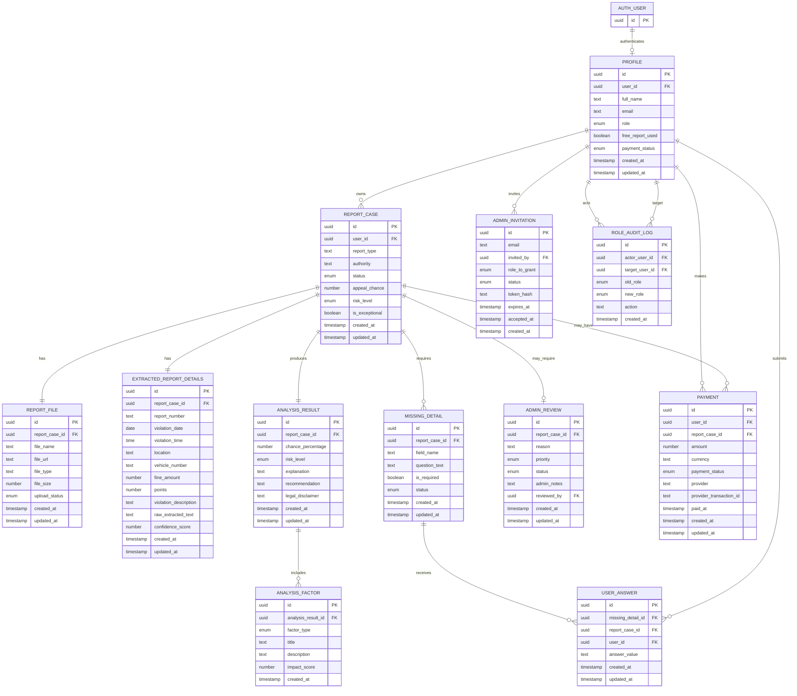

# TicketGuard - Backend Data Design & ERD

## 1. Purpose

This document describes the backend data model and ERD for the final TicketGuard project.

TicketGuard is a deployed React + Vite web application connected to Supabase for authentication, database storage, authorization policies, and secure server-side logic. The system supports regular users and admin/super_admin users, report case management, payment tracking, and protected access to user-owned data.

The model below documents the main application entities, their relationships, the role and permission model, the CRUD rules, and the Supabase implementation notes used by the final deployed project.

## 2. Authentication and App Profiles

Supabase Auth handles real user authentication, login sessions, and the canonical `auth.users.id` identity for each authenticated account.

The app-specific user record is stored in the `profiles` table. A profile stores TicketGuard-specific fields such as full name, email, role, payment status, and free report usage. The `profiles.user_id` field references `auth.users(id)`, linking the Supabase Auth identity to the application profile.

Authentication is implemented in the final project. After a user signs up or signs in, the app uses Supabase Auth session state together with the related profile row to determine what the user can see and do.

Guests are unauthenticated visitors. They do not have a `profiles` row until they register or log in.

## 3. Role Model

TicketGuard supports four access levels:

| Role | Meaning |
|---|---|
| Guest | Unauthenticated visitor who can access public pages such as the landing and login pages. |
| User | Authenticated customer. Can access only their own reports, files, answers, analysis results, and payment records. |
| Admin | Internal admin user. Can access admin dashboards and manage report/payment data according to the permissions defined by the database policies and server-side logic. |
| Super Admin | Highest permission level. Can manage admin-related actions, including admin invitations and role changes where permitted. |

Important role rules:

- Users can access only their own reports and payments.
- Admin and super_admin users can access admin dashboards according to their permissions.
- Super admin is the highest permission level and can manage admin-related actions.
- Users cannot update their own role.
- Admin users cannot create other admins unless the server-side permission flow allows it through a super_admin action.
- Admin permissions are protected by database policies and server-side logic where needed.
- Every admin promotion or demotion is recorded in `role_audit_logs`.

In the database, `profiles.role` supports only authenticated app roles:

- `user`
- `admin`
- `super_admin`

`guest` is intentionally not stored in `profiles.role` because a guest is not authenticated through Supabase Auth.

## 4. Frontend Page to Entity Mapping

| Frontend page | Main backend entities | Notes |
|---|---|---|
| LandingPage | profiles, report_cases, analysis_results, payments | Introduces the service and routes users toward login, upload, and dashboard flows. |
| LoginPage | Supabase Auth, profiles | Supabase Auth handles authentication; profiles store app-specific user data and role. |
| UploadReportPage | report_cases, report_files, profiles, payments | Creates report cases and stores uploaded PDF metadata. |
| AnalysisResultPage | report_cases, analysis_results, analysis_factors, missing_details | Shows appeal chance, risk level, factors, recommendation, and disclaimer. |
| UserDashboardPage / MyReportsPage | profiles, report_cases, analysis_results, payments | Shows only the logged-in user's report cases and relevant status information. |
| ReportDetailsPage | report_cases, report_files, extracted_report_details, analysis_results, analysis_factors, payments | Shows a single report case with related details, analysis, and payment state. |
| PaymentPage | payments, profiles, report_cases | Displays and updates payment-related state for the user/report flow. |
| AdminReviewPage | report_cases, admin_reviews, analysis_results, analysis_factors | Supports admin review of cases that require manual attention. |
| AdminReportsPage | report_cases, report_files, extracted_report_details, analysis_results, admin_reviews | Lets admins review and manage report cases. |
| AdminUsersPage | profiles, payments, report_cases, role_audit_logs | Lets admins view users according to their permissions. |
| AdminPaymentsPage | payments, profiles, report_cases | Lets admins monitor and manage payment records. |
| AdminActivityPage | role_audit_logs, admin_reviews, payments, report_cases | Shows administrative and system activity. |
| AdminSettingsPage | profiles, admin_invitations, role_audit_logs | Supports admin-related settings, invitations, and role-management audit visibility. |

## 5. Final Entity List

1. Profile
2. ReportCase
3. ReportFile
4. ExtractedReportDetails
5. MissingDetail
6. UserAnswer
7. AnalysisResult
8. AnalysisFactor
9. AdminReview
10. Payment
11. AdminInvitation
12. RoleAuditLog

## 6. Entity Attributes

### Profile

Profiles store app-specific user data and role information. Supabase Auth stores the actual login identity.

| Attribute name | Data type | Description | Shown in UI? |
|---|---|---|---|
| id | uuid | Internal profile row id. | No |
| user_id | uuid | References `auth.users(id)`. | No |
| full_name | text | User's full name. | Yes |
| email | text | User email. | Yes |
| role | enum/text | Allowed values: `user`, `admin`, `super_admin`. | Yes, for admin surfaces |
| free_report_used | boolean | Whether the user has already used the included free report allowance. | Yes |
| payment_status | enum/text | Payment state: `none`, `required`, `paid`, `failed`. | Yes |
| created_at | timestamp | Profile creation time. | No |
| updated_at | timestamp | Last profile update time. | No |

### ReportCase

Report cases represent user-submitted traffic report cases and their current processing state.

| Attribute name | Data type | Description | Shown in UI? |
|---|---|---|---|
| id | uuid | Report case id. | Yes |
| user_id | uuid | Owner user id. | No |
| report_type | text | Fine type, such as parking, traffic, or municipality. | Yes |
| authority | text | Authority that issued the fine. | Yes |
| status | enum/text | Case state: `uploaded`, `missing_details`, `analyzing`, `analyzed`, `manual_review`, `closed`. | Yes |
| appeal_chance | numeric | Estimated appeal success percentage. | Yes |
| risk_level | enum/text | Estimated risk level: `low`, `medium`, `high`. | Yes |
| is_exceptional | boolean | Whether the case requires manual admin review. | Yes |
| created_at | timestamp | Creation time. | No |
| updated_at | timestamp | Last update time. | No |

### ReportFile

Report files store metadata for uploaded PDF reports.

| Attribute name | Data type | Description | Shown in UI? |
|---|---|---|---|
| id | uuid | File metadata id. | No |
| report_case_id | uuid | Related report case. | No |
| file_name | text | Uploaded PDF file name. | Yes |
| file_url | text | Supabase Storage URL or storage path. | No |
| file_type | text | MIME type, usually `application/pdf`. | Yes |
| file_size | bigint | File size in bytes. | No |
| upload_status | enum/text | `pending`, `uploaded`, or `failed`. | Yes |
| created_at | timestamp | Upload metadata creation time. | No |
| updated_at | timestamp | Last update time. | No |

### ExtractedReportDetails

Extracted report details store structured data parsed from the uploaded report.

| Attribute name | Data type | Description | Shown in UI? |
|---|---|---|---|
| id | uuid | Extracted details id. | No |
| report_case_id | uuid | Related report case. | No |
| report_number | text | Official fine/report number. | Yes |
| violation_date | date | Violation date. | Yes |
| violation_time | time | Violation time. | Yes |
| location | text | Violation location. | Yes |
| vehicle_number | text | Vehicle number. | Yes |
| fine_amount | numeric | Fine amount. | Yes |
| points | integer | Traffic points, if relevant. | Yes |
| violation_description | text | Violation description. | Yes |
| raw_extracted_text | text | Raw text extracted from the PDF. | No |
| confidence_score | numeric | Extraction confidence score. | No |
| created_at | timestamp | Creation time. | No |
| updated_at | timestamp | Last update time. | No |

### MissingDetail

Missing details represent data points that the system needs from the user before the report can be fully processed.

| Attribute name | Data type | Description | Shown in UI? |
|---|---|---|---|
| id | uuid | Missing detail id. | No |
| report_case_id | uuid | Related report case. | No |
| field_name | text | Missing field name. | Yes |
| question_text | text | Question shown to the user. | Yes |
| is_required | boolean | Whether the answer is required to continue. | Yes |
| status | enum/text | `open`, `answered`, or `skipped`. | Yes |
| created_at | timestamp | Creation time. | No |
| updated_at | timestamp | Last update time. | No |

### UserAnswer

User answers store responses submitted for missing detail prompts.

| Attribute name | Data type | Description | Shown in UI? |
|---|---|---|---|
| id | uuid | Answer id. | No |
| missing_detail_id | uuid | Related missing detail. | No |
| report_case_id | uuid | Related report case. | No |
| user_id | uuid | User who submitted the answer. | No |
| answer_value | text | User answer. | Yes |
| created_at | timestamp | Creation time. | No |
| updated_at | timestamp | Last update time. | No |

### AnalysisResult

Analysis results store the system's output for a report case.

| Attribute name | Data type | Description | Shown in UI? |
|---|---|---|---|
| id | uuid | Analysis result id. | No |
| report_case_id | uuid | Related report case. | No |
| chance_percentage | numeric | Estimated appeal success chance. | Yes |
| risk_level | enum/text | Estimated risk level: `low`, `medium`, `high`. | Yes |
| explanation | text | General explanation of the analysis. | Yes |
| recommendation | text | User-facing recommendation. | Yes |
| legal_disclaimer | text | Legal disclaimer. | Yes |
| created_at | timestamp | Creation time. | No |
| updated_at | timestamp | Last update time. | No |

### AnalysisFactor

Analysis factors break the result into strong points, weak points, and missing information.

| Attribute name | Data type | Description | Shown in UI? |
|---|---|---|---|
| id | uuid | Analysis factor id. | No |
| analysis_result_id | uuid | Related analysis result. | No |
| factor_type | enum/text | `strong_point`, `weak_point`, or `missing_info`. | Yes |
| title | text | Factor title. | Yes |
| description | text | Factor explanation. | Yes |
| impact_score | numeric | Estimated impact on appeal chance. | No |
| created_at | timestamp | Creation time. | No |

### AdminReview

Admin reviews track manual review work for report cases that require admin attention.

| Attribute name | Data type | Description | Shown in UI? |
|---|---|---|---|
| id | uuid | Admin review id. | No |
| report_case_id | uuid | Exceptional report case id. | Yes |
| reason | text | Reason the case requires review. | Yes |
| priority | enum/text | `low`, `medium`, `high`, or `urgent`. | Yes |
| status | enum/text | `pending`, `in_review`, or `resolved`. | Yes |
| admin_notes | text | Admin review notes. | Yes |
| reviewed_by | uuid | Reviewing admin user id. | No |
| created_at | timestamp | Creation time. | No |
| updated_at | timestamp | Last update time. | No |

### Payment

Payments track the payment state for users and report-related paid flows.

| Attribute name | Data type | Description | Shown in UI? |
|---|---|---|---|
| id | uuid | Payment id. | No |
| user_id | uuid | Paying user id. | No |
| report_case_id | uuid | Optional related report case. | No |
| amount | numeric | Payment amount. | Yes |
| currency | text | Currency, such as `ILS`. | Yes |
| payment_status | enum/text | `pending`, `paid`, `failed`, or `refunded`. | Yes |
| provider | text | Payment provider. | No |
| provider_transaction_id | text | Provider transaction id. | No |
| paid_at | timestamp | Actual payment time. | Yes |
| created_at | timestamp | Creation time. | No |
| updated_at | timestamp | Last update time. | No |

### AdminInvitation

Admin invitations support inviting an email address to become an admin through the controlled admin invitation flow.

Only `super_admin` can create admin invitations. `role_to_grant` is intentionally limited to `admin`; invitations must not create additional super admins.

| Attribute name | Data type | Description | Shown in UI? |
|---|---|---|---|
| id | uuid | Invitation id. | No |
| email | text | Email address invited to become admin. | Yes |
| invited_by | uuid | Super admin user id that created the invitation. | No |
| role_to_grant | enum/text | Allowed value: `admin`. | Yes |
| status | enum/text | `pending`, `accepted`, `expired`, or `revoked`. | Yes |
| token_hash | text | Hashed invitation token. Never store the raw token. | No |
| expires_at | timestamp | Invitation expiration time. | Yes |
| accepted_at | timestamp | Time the invitation was accepted. | Yes |
| created_at | timestamp | Creation time. | No |

### RoleAuditLog

Role audit logs track role changes for accountability.

Every admin promotion or demotion creates a row in this table.

| Attribute name | Data type | Description | Shown in UI? |
|---|---|---|---|
| id | uuid | Audit log id. | No |
| actor_user_id | uuid | Super admin who performed the role change. | No |
| target_user_id | uuid | User whose role changed. | No |
| old_role | enum/text | Previous role. | Yes, for admin audit screens |
| new_role | enum/text | New role. | Yes, for admin audit screens |
| action | text | Action name, such as `promote_admin` or `demote_admin`. | Yes, for admin audit screens |
| created_at | timestamp | Audit event time. | No |

## 7. Relationships

| Entity A | Relationship type | Entity B | Explanation |
|---|---|---|---|
| Supabase Auth User | One-to-One | Profile | Each authenticated user can have one app profile. |
| Profile | One-to-Many | ReportCase | A user can create many report cases. |
| ReportCase | One-to-One | ReportFile | A report case currently has one main PDF file. |
| ReportCase | One-to-One | ExtractedReportDetails | A report case has one extracted details record. |
| ReportCase | One-to-Many | MissingDetail | A report case can require several missing details. |
| MissingDetail | One-to-Many | UserAnswer | A missing detail can receive answers or updates. |
| Profile | One-to-Many | UserAnswer | A user can submit many answers. |
| ReportCase | One-to-One | AnalysisResult | A report case has one latest analysis result. |
| AnalysisResult | One-to-Many | AnalysisFactor | An analysis contains several factors. |
| ReportCase | One-to-Zero-or-One | AdminReview | Only exceptional cases require an admin review. |
| Profile | One-to-Many | Payment | A user can make many payments. |
| ReportCase | One-to-Many | Payment | A report case may have related payment records. |
| Profile | One-to-Many | AdminInvitation through `invited_by` | A super admin can create many admin invitations. |
| Profile | One-to-Many | RoleAuditLog as `actor_user_id` | A super admin can perform many role changes. |
| Profile | One-to-Many | RoleAuditLog as `target_user_id` | A user can be the target of many role changes. |

## 8. CRUD Matrix

| Entity | Create | Read | Update | Delete |
|---|---|---|---|---|
| Profile | System after Supabase Auth signup | User reads self; admin/super_admin read according to admin permissions | User can update own profile fields but not role; system and permitted admin flows can update payment/status fields; only super_admin flow can change admin-related roles | System or owner process only; no normal manual delete |
| ReportCase | User/system during report upload | User reads only own cases; admin/super_admin read according to admin permissions | System updates analysis/status/exception flags; admin/super_admin can update admin-managed status where permitted | System or owner process only |
| ReportFile | User/system during PDF upload | Owner user reads own file metadata; admin/super_admin read according to related case permissions | System updates upload status and storage URL/path | System or owner process only |
| ExtractedReportDetails | System after extraction | Owner user reads own details; admin/super_admin read according to related case permissions | System updates after processing | System only |
| MissingDetail | System when extraction finds missing data | Owner user reads own missing details; admin/super_admin read according to related case permissions | User can answer related prompts; system updates missing detail status | System only |
| UserAnswer | User submits answers | Owner user reads own answers; admin/super_admin read according to related case permissions; system reads for analysis | User can update before final processing; system can normalize values | System or owner process only |
| AnalysisResult | System creates after analysis | User reads own results; admin/super_admin read according to related case permissions | System updates after re-analysis | System only |
| AnalysisFactor | System creates with analysis | User/admin/super_admin read according to related case permissions | System updates after re-analysis | System only |
| AdminReview | System creates for cases requiring review | Admin/super_admin read according to admin permissions | Admin/super_admin update review status, notes, and reviewer fields where permitted; system can auto-close if needed | System or super_admin only |
| Payment | System/payment flow creates | User reads own payments; admin/super_admin read according to admin permissions | System/payment confirmation flow updates status | System only; keep records for audit |
| AdminInvitation | Only super_admin flow | Super admin reads invitations; invited user may validate a pending invite by token flow | Super admin can revoke; system can mark accepted/expired | Super admin/system only |
| RoleAuditLog | System creates when a role changes | Super admin and permitted admin activity views can read audit history | Immutable after creation | No manual delete |

Additional permission requirements:

- User cannot update their own role.
- User cannot read another user's reports or payments.
- Admin cannot promote or demote any user unless the action is performed through the permitted super_admin flow.
- Admin cannot create admin invitations.
- Super admin can create admin invitations and manage admin-related role changes.
- System can create analysis results and set admin review flags.
- Admin and super_admin permissions are enforced by Supabase RLS policies and secure server-side logic where needed.

## 9. ERD

## 10. Supabase Implementation Notes

The final TicketGuard project uses Supabase as the backend for authentication, persistent data, authorization, and secure server-side operations.

Implementation notes:

- Supabase Auth is used for user authentication and session management.
- Supabase tables store profiles, report cases, uploaded report file metadata, extracted report details, missing detail prompts, user answers, analysis results, analysis factors, admin reviews, payments, admin invitations, and role audit logs.
- `profiles.user_id` references `auth.users(id)`.
- RLS policies protect user-owned data so regular users can access only their own reports, answers, analysis data, and payments.
- Admin and super_admin access is separated from regular user access.
- Admin/super_admin permissions are enforced through Supabase RLS policies and server-side logic where needed.
- Supabase Edge Functions are used for secure server-side operations, such as admin user creation and payment confirmation.
- Admin invitation tokens must be hashed before storage.
- Role changes are recorded in `role_audit_logs` for accountability.
- Environment variables are stored in Vercel and are not committed to GitHub.

## 11. Final Submission Checklist

- [x] Supabase Auth is used for authentication.
- [x] Profiles store app-specific user and role data.
- [x] Report cases and related entities are modeled.
- [x] Payment records are modeled.
- [x] Admin and super_admin roles are modeled.
- [x] Admin invitations and role audit logs are modeled.
- [x] ERD is included in this file.
- [x] RLS and permissions are part of the Supabase implementation.
- [x] The deployed app is connected to Supabase and Vercel.
