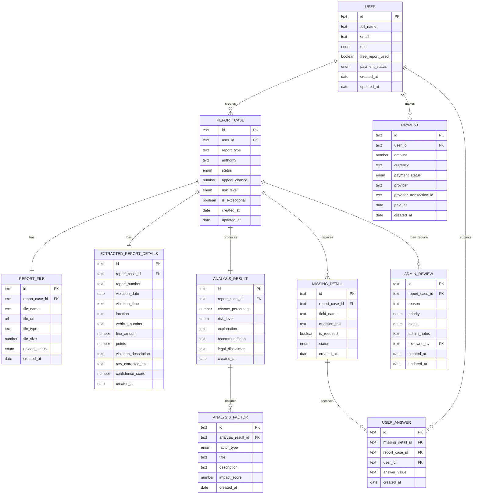

# TicketGuard - תכנון נתונים למודול 7

## 1. הקדמה קצרה

מסמך זה מתאר את מודל הנתונים העתידי של TicketGuard, על בסיס מסכי ה־Frontend הקיימים בפרויקט: דף נחיתה, העלאת דוח, השלמת פרטים חסרים, תוצאת ניתוח, אזור אישי, מסך ניהול וכניסה.

בשלב הנוכחי המערכת היא Frontend בלבד ומשתמשת בנתוני דמו. מודל הנתונים במסמך זה נועד להכין את הפרויקט לשלב הבא, שבו ניתן יהיה לממש את הישויות כטבלאות אמיתיות ב־Supabase.

## 2. מיפוי עמודים לישויות

| עמוד Frontend | ישויות שמופיעות בעמוד | הערה |
|---|---|---|
| LandingPage | User, ReportCase, AnalysisResult, Payment | מציג את רעיון המערכת, דוח ראשון חינם, והכוונה להעלאת דוח. |
| UploadReportPage | ReportCase, ReportFile, User, Payment | המשתמש מעלה קובץ PDF, והמערכת יוצרת בעתיד תיק דוח וקובץ מקושר. |
| MissingDetailsPage | ReportCase, ExtractedReportDetails, MissingDetail, UserAnswer | מוצגים פרטים שחולצו מהדוח ושאלות להשלמת מידע חסר. |
| AnalysisResultPage | ReportCase, AnalysisResult, AnalysisFactor, MissingDetail | מציג סיכוי ערעור, רמת סיכון, הסבר, נקודות חוזק, נקודות חולשה ומידע חסר. |
| UserDashboardPage | User, ReportCase, AnalysisResult, Payment | מציג דוחות של משתמש, סטטוסים, ותזכורת למודל תשלום עתידי. |
| AdminReviewPage | ReportCase, AdminReview, AnalysisResult, AnalysisFactor | מציג רק מקרים חריגים שדורשים בדיקה ידנית. |
| LoginPage | User | מסך כניסה עתידי שיתחבר ל־Supabase Auth. |

## 3. רשימת ישויות סופית

1. User
2. ReportCase
3. ReportFile
4. ExtractedReportDetails
5. MissingDetail
6. UserAnswer
7. AnalysisResult
8. AnalysisFactor
9. AdminReview
10. Payment

## 4. תכונות לכל ישות

### User

| Attribute name | Data type | Description | Is shown in UI? |
|---|---|---|---|
| id | Text | מזהה ייחודי של המשתמש | No |
| full_name | Text | שם מלא של המשתמש | Yes |
| email | Text | כתובת אימייל לכניסה | Yes |
| role | Enum | סוג משתמש: Guest, User, Admin | Yes |
| free_report_used | Boolean | האם המשתמש כבר השתמש בדוח החינמי | Yes |
| payment_status | Enum | מצב תשלום: none, required, paid, failed | Yes |
| created_at | Date | תאריך יצירת המשתמש | No |
| updated_at | Date | תאריך עדכון אחרון | No |

### ReportCase

| Attribute name | Data type | Description | Is shown in UI? |
|---|---|---|---|
| id | Text | מזהה תיק דוח | Yes |
| user_id | Text | מזהה המשתמש שיצר את התיק | No |
| report_type | Text | סוג הדוח, לדוגמה דוח חניה או מצלמת מהירות | Yes |
| authority | Text | הרשות שהפיקה את הדוח | Yes |
| status | Enum | סטטוס התיק: uploaded, missing_details, analyzed, manual_review | Yes |
| appeal_chance | Number | אחוז סיכוי משוער לערעור | Yes |
| risk_level | Enum | רמת סיכון: נמוכה, בינונית, גבוהה | Yes |
| is_exceptional | Boolean | האם התיק חריג ודורש בדיקת מנהל | Yes |
| created_at | Date | תאריך יצירת התיק | No |
| updated_at | Date | תאריך עדכון אחרון | No |

### ReportFile

| Attribute name | Data type | Description | Is shown in UI? |
|---|---|---|---|
| id | Text | מזהה קובץ | No |
| report_case_id | Text | מזהה תיק הדוח שאליו הקובץ שייך | No |
| file_name | Text | שם קובץ ה־PDF | Yes |
| file_url | URL | קישור עתידי לקובץ ב־Supabase Storage | No |
| file_type | Text | סוג הקובץ, לדוגמה application/pdf | Yes |
| file_size | Number | גודל הקובץ בבייטים | No |
| upload_status | Enum | סטטוס העלאה: pending, uploaded, failed | Yes |
| created_at | Date | תאריך העלאת הקובץ | No |

### ExtractedReportDetails

| Attribute name | Data type | Description | Is shown in UI? |
|---|---|---|---|
| id | Text | מזהה רשומת פרטים שחולצו | No |
| report_case_id | Text | מזהה תיק הדוח | No |
| report_number | Text | מספר דוח רשמי | Yes |
| violation_date | Date | תאריך ביצוע העבירה | Yes |
| violation_time | Text | שעת ביצוע העבירה | Yes |
| location | Text | מיקום העבירה | Yes |
| vehicle_number | Text | מספר רכב | Yes |
| fine_amount | Number | סכום הקנס | Yes |
| points | Number | נקודות תעבורה אם קיימות | Yes |
| violation_description | Text | תיאור העבירה | Yes |
| raw_extracted_text | Text | טקסט גולמי שחולץ מהמסמך | No |
| confidence_score | Number | רמת ביטחון בזיהוי הנתונים | No |
| created_at | Date | תאריך יצירת הרשומה | No |

### MissingDetail

| Attribute name | Data type | Description | Is shown in UI? |
|---|---|---|---|
| id | Text | מזהה שדה חסר | No |
| report_case_id | Text | מזהה תיק הדוח | No |
| field_name | Text | שם השדה החסר במערכת | Yes |
| question_text | Text | שאלה שמוצגת למשתמש להשלמת מידע | Yes |
| is_required | Boolean | האם השדה חובה להמשך | Yes |
| status | Enum | סטטוס: open, answered, skipped | Yes |
| created_at | Date | תאריך יצירת השדה החסר | No |

### UserAnswer

| Attribute name | Data type | Description | Is shown in UI? |
|---|---|---|---|
| id | Text | מזהה תשובה | No |
| missing_detail_id | Text | מזהה השדה החסר | No |
| report_case_id | Text | מזהה תיק הדוח | No |
| user_id | Text | מזהה המשתמש שענה | No |
| answer_value | Text | תשובת המשתמש | Yes |
| created_at | Date | תאריך יצירת התשובה | No |

### AnalysisResult

| Attribute name | Data type | Description | Is shown in UI? |
|---|---|---|---|
| id | Text | מזהה תוצאת ניתוח | No |
| report_case_id | Text | מזהה תיק הדוח | No |
| chance_percentage | Number | אחוז סיכוי ערעור משוער | Yes |
| risk_level | Enum | רמת סיכון משוערת | Yes |
| explanation | Text | הסבר כללי על הניתוח | Yes |
| recommendation | Text | המלצה כללית למשתמש | Yes |
| legal_disclaimer | Text | הבהרה משפטית | Yes |
| created_at | Date | תאריך יצירת התוצאה | No |

### AnalysisFactor

| Attribute name | Data type | Description | Is shown in UI? |
|---|---|---|---|
| id | Text | מזהה גורם ניתוח | No |
| analysis_result_id | Text | מזהה תוצאת הניתוח | No |
| factor_type | Enum | סוג גורם: strong_point, weak_point, missing_info | Yes |
| title | Text | כותרת הגורם | Yes |
| description | Text | פירוט הגורם | Yes |
| impact_score | Number | משקל השפעה על הסיכוי | No |
| created_at | Date | תאריך יצירת הגורם | No |

### AdminReview

| Attribute name | Data type | Description | Is shown in UI? |
|---|---|---|---|
| id | Text | מזהה בדיקה ידנית | No |
| report_case_id | Text | מזהה תיק הדוח החריג | Yes |
| reason | Text | סיבת החריגה | Yes |
| priority | Enum | עדיפות: נמוכה, בינונית, גבוהה | Yes |
| status | Enum | סטטוס בדיקה: pending, in_review, resolved | Yes |
| admin_notes | Text | הערות מנהל | Yes |
| reviewed_by | Text | מזהה מנהל שבדק | No |
| created_at | Date | תאריך יצירת הבדיקה | No |
| updated_at | Date | תאריך עדכון אחרון | No |

### Payment

| Attribute name | Data type | Description | Is shown in UI? |
|---|---|---|---|
| id | Text | מזהה תשלום | No |
| user_id | Text | מזהה המשתמש ששילם | No |
| amount | Number | סכום התשלום | Yes |
| currency | Text | מטבע, לדוגמה ILS | Yes |
| payment_status | Enum | סטטוס: pending, paid, failed, refunded | Yes |
| provider | Text | ספק תשלום עתידי | No |
| provider_transaction_id | Text | מזהה עסקה אצל ספק התשלום | No |
| paid_at | Date | תאריך תשלום בפועל | Yes |
| created_at | Date | תאריך יצירת רשומת התשלום | No |

## 5. קשרים בין ישויות

| Entity A | Relationship type | Entity B | Explanation | Junction table if needed |
|---|---|---|---|---|
| User | One-to-Many | ReportCase | משתמש יכול ליצור כמה תיקי דוחות | לא נדרש |
| ReportCase | One-to-One | ReportFile | לכל תיק יש קובץ PDF עיקרי אחד בשלב הראשון | לא נדרש |
| ReportCase | One-to-One | ExtractedReportDetails | לכל תיק יש רשומת פרטים שחולצה מהמסמך | לא נדרש |
| ReportCase | One-to-Many | MissingDetail | תיק יכול להכיל כמה פרטים חסרים | לא נדרש |
| MissingDetail | One-to-Many | UserAnswer | שדה חסר יכול לקבל תשובות, למשל במקרה של עדכון חוזר | לא נדרש |
| User | One-to-Many | UserAnswer | משתמש יכול לענות על כמה שאלות השלמה | לא נדרש |
| ReportCase | One-to-One | AnalysisResult | לכל תיק יש תוצאת ניתוח אחת אחרונה | לא נדרש |
| AnalysisResult | One-to-Many | AnalysisFactor | תוצאת ניתוח כוללת נקודות חוזק, חולשה ומידע חסר | לא נדרש |
| ReportCase | One-to-One | AdminReview | רק תיק חריג מקבל רשומת בדיקת מנהל | לא נדרש |
| User | One-to-Many | Payment | משתמש יכול לבצע כמה תשלומים לאורך זמן | לא נדרש |

## 6. מטריצת CRUD

| Entity | Create | Read | Update | Delete |
|---|---|---|---|---|
| User | נוצר בעת הרשמה או דרך Auth עתידי | המשתמש רואה את עצמו, Admin לפי צורך | משתמש מעדכן פרופיל, System מעדכן סטטוס | מחיקה רכה בלבד על ידי Admin/System |
| ReportCase | Guest/User יוצר בעת העלאת דוח | User רואה תיקים שלו, Admin רואה חריגים | System מעדכן סטטוס וסיכוי, Admin מעדכן בדיקה | מחיקה רכה בלבד |
| ReportFile | User/System יוצרים בעת העלאת PDF | User רואה קובץ שלו, System קורא לניתוח | System מעדכן סטטוס העלאה | מחיקה רכה או מחיקה מ־Storage לפי מדיניות |
| ExtractedReportDetails | System יוצר אחרי OCR/AI | User רואה פרטים של תיק שלו | System מעדכן אם הופק ניתוח מחדש | לא נמחק בדרך כלל |
| MissingDetail | System יוצר לפי פרטים חסרים | User/Admin/System קוראים לפי הרשאות | System/User מעדכנים סטטוס לאחר תשובה | לא נמחק בדרך כלל |
| UserAnswer | User יוצר תשובה | User רואה תשובות שלו, System קורא לניתוח | User יכול לעדכן לפני ניתוח סופי | מחיקה רכה בלבד |
| AnalysisResult | System יוצר לאחר ניתוח | User רואה תוצאה שלו, Admin רואה חריגים | System יכול לעדכן בניתוח חוזר | לא נמחק בדרך כלל |
| AnalysisFactor | System יוצר כחלק מהניתוח | User/Admin קוראים לפי הרשאות | System מעדכן בניתוח חוזר | לא נמחק בדרך כלל |
| AdminReview | System יוצר לתיקים חריגים | Admin קורא מקרים חריגים | Admin מעדכן סטטוס והערות | מחיקה רכה בלבד |
| Payment | System/Provider יוצר לאחר תשלום | User רואה סטטוס שלו, Admin לפי צורך | System/Provider מעדכן סטטוס | אין מחיקה ידנית של עסקה |

## 7. דיאגרמת ERD

## 8. הרשאות לפי תפקידים

ההרשאות הבאות מתארות את ההתנהגות העתידית הרצויה. בשלב הנוכחי אין Backend ואין אכיפת הרשאות אמיתית, אך המודל מכין את המערכת ל־Supabase Row Level Security במודול הבא.

| Entity | Action | Who is allowed? | Explanation |
|---|---|---|---|
| User | Create | Guest, System | אורח יוכל להירשם בעתיד; Supabase Auth ייצור משתמש אמיתי. |
| User | Read | User, Admin, System | User רואה רק את עצמו; Admin לפי צורך ניהולי. |
| User | Update | User, System | User יעדכן פרופיל; System יעדכן סטטוס דוח חינם ותשלום. |
| User | Delete | Admin, System | מחיקה רכה בלבד, לא מחיקה פיזית מיידית. |
| ReportCase | Create | Guest, User, System | Guest יוכל ליצור דוח חינמי אחד; User יוכל ליצור תיקים לאחר התחברות. |
| ReportCase | Read | Guest, User, Admin, System | Guest רואה רק את תוצאת הדוח החינמי שהעלה; User רואה רק תיקים שלו; Admin רואה חריגים בלבד. |
| ReportCase | Update | System, Admin | System מעדכן סטטוס וניתוח; Admin מעדכן רק בהקשר בדיקה ידנית. |
| ReportCase | Delete | Admin, System | מחיקה רכה בלבד. |
| ReportFile | Create | Guest, User, System | העלאת PDF לתיק של המשתמש בלבד. |
| ReportFile | Read | Guest, User, System | משתמש רואה רק קבצים של התיקים שלו; System קורא לניתוח. |
| ReportFile | Update | System | עדכון סטטוס העלאה או URL לאחר שמירה ב־Storage. |
| ReportFile | Delete | System, Admin | מחיקה לפי מדיניות שמירת קבצים. |
| ExtractedReportDetails | Create | System | נוצר על ידי OCR/AI עתידי בלבד. |
| ExtractedReportDetails | Read | User, Admin, System | User רואה פרטים של תיק שלו; Admin רואה רק אם התיק חריג. |
| ExtractedReportDetails | Update | System | עדכון רק לאחר ניתוח מחדש. |
| ExtractedReportDetails | Delete | System | לא נמחק בדרך כלל, אלא אם נמחק תיק שלם. |
| MissingDetail | Create | System | System יוצר שאלות על מידע חסר. |
| MissingDetail | Read | User, Admin, System | User רואה שאלות של הדוח שלו; Admin רואה בתיקים חריגים. |
| MissingDetail | Update | User, System | User יכול להשלים תשובה; System מעדכן סטטוס השדה. |
| MissingDetail | Delete | System | לא נמחק בדרך כלל. |
| UserAnswer | Create | User, Guest | User או Guest עונה רק על שאלות ששייכות לתיק שלו. |
| UserAnswer | Read | User, Admin, System | User רואה תשובות שלו; Admin רק בתיקים חריגים. |
| UserAnswer | Update | User, System | User יכול לעדכן לפני ניתוח סופי; System יכול לנרמל ערכים. |
| UserAnswer | Delete | User, System | מחיקה רכה או החלפת תשובה לפני ניתוח. |
| AnalysisResult | Create | System | משתמש לא יוצר תוצאה ידנית. |
| AnalysisResult | Read | Guest, User, Admin, System | Guest רואה רק תוצאת הדוח החינמי הנוכחי; User רואה תוצאות שלו; Admin רואה חריגים. |
| AnalysisResult | Update | System | User לא יכול לערוך תוצאת AI ישירות. |
| AnalysisResult | Delete | System | לא נמחק בדרך כלל. |
| AnalysisFactor | Create | System | נוצר כחלק מתוצאת הניתוח. |
| AnalysisFactor | Read | Guest, User, Admin, System | מוצג יחד עם תוצאת הניתוח בהתאם להרשאות. |
| AnalysisFactor | Update | System | עדכון רק בניתוח חוזר. |
| AnalysisFactor | Delete | System | לא נמחק בדרך כלל. |
| AdminReview | Create | System | System יוצר דגל בדיקה ידנית לתיקים חריגים. |
| AdminReview | Read | Admin, System | Admin רואה רק מקרים חריגים לבדיקה. |
| AdminReview | Update | Admin, System | Admin מעדכן סטטוס והערות; System יכול לסגור אוטומטית לפי כללים. |
| AdminReview | Delete | System | מחיקה רכה בלבד. |
| Payment | Create | System | נוצר דרך ספק תשלום עתידי לאחר הדוח החינמי. |
| Payment | Read | User, Admin, System | User רואה סטטוס תשלום שלו; Admin לפי צורך תמיכה. |
| Payment | Update | System | נתוני עסקה לא נערכים ידנית על ידי User או Admin. |
| Payment | Delete | System | אין מחיקה ידנית של עסקאות; שמירה לצורכי ביקורת. |

## 9. הערות לקראת מודול 8 - Backend Development

במודול 8 ניתן להפוך את מודל הנתונים במסמך זה לטבלאות אמיתיות ב־Supabase.

החלקים הטכניים העתידיים:

- Supabase Auth לניהול משתמשים, הרשמה וכניסה.
- טבלאות Supabase PostgreSQL לפי הישויות במסמך זה.
- Supabase Storage לשמירת קבצי PDF שהמשתמש מעלה.
- Row Level Security כדי שמשתמשים יוכלו לגשת רק לנתונים שלהם.
- הרשאות Admin בלבד למקרים חריגים שדורשים בדיקה ידנית.
- Edge Function או API endpoint עתידי לניתוח AI/OCR של הדוחות.
- אינטגרציה עתידית לספק תשלום עבור תשלום חד־פעמי אחרי הדוח החינמי הראשון.

ה־Frontend הנוכחי עדיין משתמש בנתוני דמו בלבד. המסמך הזה מכין את מבנה הנתונים לשלב הפיתוח הבא, בלי לחבר עדיין Backend אמיתי.

## 10. צ׳קליסט מודול 7

- [x] כל עמוד ב־Frontend נסרק ומופה לישויות
- [x] קיימת רשימת ישויות מסכמת ללא כפילויות
- [x] לכל ישות הוגדרו תכונות וסוגי נתונים
- [x] נכללו שדות נסתרים כמו id, created_at, updated_at ו־user_id / foreign keys
- [x] הקשרים בין הישויות מופו
- [x] מטריצת CRUD הוגדרה לכל הישויות
- [x] קיימת דיאגרמת ERD ב־Mermaid
- [x] הוגדרו הרשאות לפי תפקידים
- [x] המודל מתאים להמשך עבודה עם Supabase במודול 8
